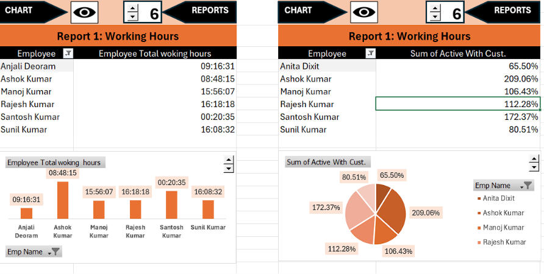

# 📊 Excel Data Analysis & Interactive Dashboard

## 📌 Project Overview

This project focuses on analyzing employee performance and working-hour data using Microsoft Excel.

An interactive Excel dashboard was created to present key performance metrics, working hours, efficiency, and overall employee performance in an easy-to-understand visual format.

The project also uses VBA macros to provide interactive dashboard controls for switching between charts and reports.

---

## 🎯 Project Objectives

- Analyze employee working hours
- Evaluate employee efficiency and performance
- Identify differences in employee performance
- Create interactive reports and dashboards
- Present insights using charts and visualizations
- Use VBA to add interactivity to the dashboard

---

## 📂 Workbook Structure

The Excel workbook contains the following sheets:

### 1. Break
Contains analysis related to employee break time and working patterns.

### 2. Efficiency
Contains employee efficiency-related analysis and performance metrics.

### 3. Over All Performance
Provides an overall view of employee performance.

### 4. Summary
Contains summarized employee-level performance information.

### 5. Dashboard
Interactive dashboard containing charts, reports, navigation buttons, and interactive controls.

---

## 📊 Dashboard Features

The dashboard includes:

- Employee working-hour analysis
- Employee efficiency analysis
- Overall performance reports
- Interactive charts
- Pivot Tables
- Pivot Charts
- Dashboard navigation
- Spinner controls
- VBA-based interactivity

---

## 🛠️ Tools & Technologies

- Microsoft Excel
- Pivot Tables
- Pivot Charts
- Excel Charts
- VBA (Visual Basic for Applications)
- Data Cleaning
- Data Analysis
- Data Visualization
- Dashboard Development

---

## 📈 Key Analysis Areas

The project analyzes:

- Employee total working hours
- Employee efficiency
- Active working performance
- Overall employee performance
- Employee-level comparisons

---

## 🖥️ Dashboard Preview

---

## 📁 Project Files

| File | Description |
|------|-------------|
| `Excel_Project.xlsm` | Complete Excel workbook containing analysis, dashboard, charts, and VBA macros |
| `Excel_Dashboard.png` | Dashboard preview |

---

## 🚀 How to Use

1. Download `Excel_Project.xlsm`.
2. Open the workbook using Microsoft Excel.
3. Enable macros if Excel displays a security warning.
4. Navigate to the **Dashboard** sheet.
5. Use the interactive controls to explore different reports and charts.

---

## 💡 Skills Demonstrated

- Excel Data Analysis
- Data Cleaning
- Data Visualization
- Dashboard Development
- Pivot Tables
- Pivot Charts
- VBA Automation
- Business Reporting
- Performance Analysis

---

## 👩‍💻 Author

**Suchita Kunghatkar**

Aspiring Data Analyst | Python | SQL | Excel | Power BI
